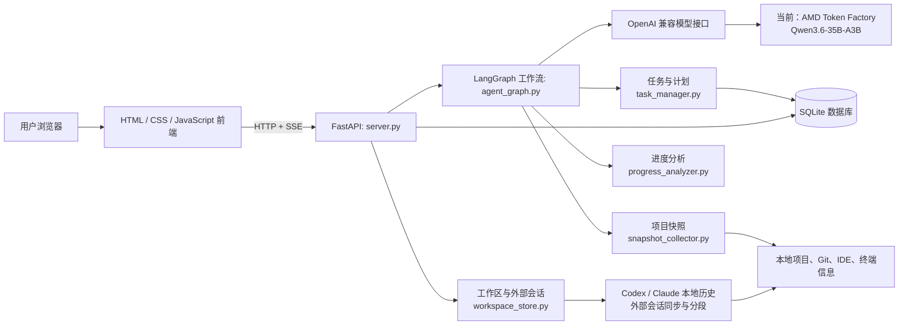

# Work Assistant 中文架构说明

> 本文基于当前可运行基线（`baseline-tokenfactory`）阅读代码整理。它用于帮助项目作者理解、讲解和维护项目；**不是比赛提交材料**。比赛仓库中的 README、项目说明和演示材料仍应使用英文。

## 1. 这个项目在做什么

Work Assistant 是一个运行在本机 Windows 上的开发工作助手。它把“与用户聊天、创建开发任务、扫描本地项目状态、判断进度、整理外部 AI 会话和工作上下文”放进一个 Web 程序中。

它的核心不是替用户直接写代码，而是回答这三个问题：

1. 我现在要做什么？——把自然语言需求变成可执行的任务计划。
2. 我的项目做到哪里了？——读取本地 Git、文件、IDE、终端等线索，形成工作快照并分析进度。
3. 我怎样快速恢复上下文？——整理 Codex / Claude 的本地会话、项目、工作项和上下文包。

当前版本把大模型能力接到 AMD Radeon Token Factory 的 OpenAI 兼容 API：`Qwen3.6-35B-A3B`。模型负责理解、分类、规划和归纳；本地程序负责读取真实项目状态、保存数据、提供界面。

## 2. 一张图理解整体结构



可以这样记忆：**浏览器是操作台，FastAPI 是总入口，LangGraph 是决策流程，本地扫描器提供证据，大模型负责理解和总结，SQLite 保存长期记忆。**

## 3. 用户发一条消息后，系统怎样工作

### 3.1 普通聊天或创建任务

1. 用户在首页输入内容，前端调用 `POST /api/chat`。
2. `server.py` 为本轮创建会话上下文、加会话锁，并把执行过程以 SSE 实时推回网页。
3. `agent_graph.py` 的 `node_route` 先用模型把请求分类为四类：
   - `new_task`：新建需求或功能；
   - `check`：接管/评估已有项目；
   - `progress`：查看某个任务的进度；
   - `chat`：普通问答。
4. 新任务或已有项目评估会先补齐“项目路径 + 目标/背景”。信息完整后：
   - 新任务由 `task_manager.py` 生成任务与计划；
   - 已有项目先扫描本地状态，再由模型根据快照和对话生成计划。
5. 任务建立后，系统采集最新快照、分析进度，并将可读结论返回页面。

### 3.2 “看看项目进度”这条路径

```text
用户指定任务
  → 读取 SQLite 中的任务计划
  → 扫描项目（Git、文件、IDE、终端、进程等）
  → 生成快照 JSON
  → 模型将「计划」与「证据」对比
  → 保存进度报告并在网页显示下一步与风险
```

关键点：模型不是凭空判断“完成了多少”，而是以本地扫描到的提交、改动文件、模块和开发状态为输入做归纳。不过结论仍是 AI 推断，重要状态应由开发者复核。

### 3.3 工作区与外部会话路径

工作区功能不依赖 LangGraph 的主对话流程。它由 `server.py` 的工作区 API 调用以下模块：

- `external_conversation_sync.py`：增量读取本机 Codex、Claude 的会话记录；
- `conversation_manager.py`：读取、筛选和展示会话消息；
- `semantic_segmenter.py`：把长会话按语义拆分成片段；
- `project_matcher.py`：将会话内容与项目关联；
- `work_item_discovery.py` / `work_item_context.py`：提取工作项并生成上下文包；
- `workspace_store.py`：把项目、会话、片段、工作项及上下文包统一存入 SQLite。

这部分的目标是：即使你切换了 Codex / Claude 会话，仍能在本程序中找到“这个项目之前讨论过什么、目前该继续什么”。

## 4. 主要文件：该去哪儿看、什么情况下修改

| 模块 | 主要职责 | 通常何时修改 |
|---|---|---|
| `server.py` | FastAPI 路由、SSE 流式输出、网页接口、应用启动 | 新增页面/API、调整接口行为 |
| `agent_graph.py` | LangGraph 状态、意图路由、任务/检查/进度流程 | 改 Agent 的思考流程、增加意图或节点 |
| `task_manager.py` | 任务、计划、子任务的创建与 SQLite 持久化 | 改任务字段、计划生成与保存规则 |
| `snapshot_collector.py` | 扫描 Git、文件、IDE、终端和开发进程 | 改“进度判断要收集哪些本地证据” |
| `progress_analyzer.py` | 将任务计划和快照交给模型，保存进度结果 | 改完成度、风险、下一步的判断逻辑 |
| `llm_analyzer.py` | 对快照和代码信息做 LLM 归纳 | 改发送给模型的项目分析材料 |
| `settings.py` | 所有运行配置、密钥读取、设置持久化 | 换模型端点、增加配置项、调整密钥策略 |
| `conversation_manager.py` | 对话保存及 Codex/Claude 本地会话读取 | 改会话管理或外部历史解析 |
| `workspace_store.py` | 工作区 SQLite 数据模型 | 改项目/会话/工作项的数据结构 |
| `external_*`、`project_matcher.py`、`semantic_segmenter.py` | 外部 AI 会话同步、恢复与归类 | 扩展新的 AI 工具或改上下文恢复逻辑 |
| `templates/*.html` | 页面结构（首页、设置、任务、工作区） | 改界面布局和按钮 |
| `static/*` | CSS 和浏览器端交互 | 改视觉样式、消息渲染和前端交互 |
| `tests/` | 自动化测试 | 新功能或修复后补充回归测试 |

## 5. 大模型调用在哪里发生

项目对模型的共同入口是 `agent_graph.py` 中的 `get_llm()`：它使用 `ChatOpenAI`，并从设置中读取：

```text
模型名：AMD_MODEL
服务地址：AMD_BASE_URL
密钥：AMD_API_KEY（或 Windows Credential Manager）
```

目前它们指向 Radeon Token Factory 的 Qwen API。模型主要用于：

- 意图识别：判断用户是在新建任务、检查项目、查询进度还是聊天；
- 信息收集：从多轮对话中提取项目路径和任务描述；
- 任务规划：生成任务、步骤与子任务；
- 项目初始化：根据已有项目快照推断当前计划；
- 进度分析：把“计划 + 本地证据”整理为完成度、风险和下一步；
- 普通对话与外部会话的语义整理。

因此，**模型替换不等于重写整个项目**。业务工作流、数据库、扫描器和网页不应因切换模型而改变。

## 6. 配置、密钥与本地数据

### 配置和密钥

- `.env.example` 是可公开的配置模板；不要把真实 `.env` 上传到 GitHub。
- `settings.py` 会将普通设置保存到本地设置数据库。
- API Key 优先从环境变量读取；Windows 下也支持通过 `keyring` 保存到 Windows Credential Manager。
- 设置页面 `/setup` 和 `/settings` 用于首次配置和之后修改。

### 本地持久化数据

| 数据 | 默认位置 | 用途 |
|---|---|---|
| 任务与计划 | `data/agent.db` | 任务、步骤、进度状态 |
| LangGraph 会话检查点 | `data/checkpoints.db` | 多轮对话状态恢复 |
| 应用对话记录 | `data/conversations.db` | 网页会话和消息 |
| 工作区资料 | `data/work_assistant.db` | 项目、外部会话、片段、工作项、上下文包 |
| 设置 | `data/settings.db` | 模型地址、开关及本地配置 |
| 项目快照 | `snapshots/` | 某次扫描的 JSON 证据 |

这些都是运行产生的个人数据，已经不应作为比赛源代码上传。

## 7. 隐私边界：哪些信息可能发送给模型

项目会读取本机项目的 Git 信息、改动摘要、模块信息、IDE 线索、终端历史和开发进程等。用于模型分析的摘要受两个开关控制：

- `SEND_COMMIT_INFO`：是否发送提交信息；
- `SEND_DIFF_SUMMARY`：是否发送代码差异摘要。

在演示或连接第三方模型前，应避免扫描包含公司机密、客户数据或真实密钥的目录；需要时关闭以上开关，并确认 `.env`、数据库、快照没有进入提交。

## 8. 从 Token Factory 切到 Radeon Cloud / vLLM，应改哪里

现有代码已经按 OpenAI 兼容接口设计。若 Radeon Cloud 部署的 vLLM 服务提供 OpenAI 兼容的 `/v1` 地址，第一轮替换应只改配置，不改 Agent 业务代码：

```text
AMD_BASE_URL = 你的 Radeon Cloud vLLM OpenAI 兼容地址（通常以 /v1 结尾）
AMD_MODEL    = 该服务实际暴露的模型名
AMD_API_KEY  = 该服务要求的密钥（如有）
```

推荐的安全顺序：

1. 保留目前 Token Factory 配置和已打好的 `baseline-tokenfactory` 标签；
2. 在设置页面或 `.env` 填入云端 vLLM 地址、模型名、密钥；
3. 先用一个简单聊天请求验证连通性；
4. 再依次验证新建任务、已有项目检查、进度分析和 SSE 流式输出；
5. 为比赛录制 Radeon GPU / vLLM 部署与实际调用的证据；
6. 只有当云端接口不兼容 OpenAI 格式时，才在 `settings.py` 和 LLM 创建层增加“提供方适配器”。不要在每一个业务节点里分别硬编码新地址。

也就是说，切云服务的主要风险在“端点、模型名、认证、流式兼容性”，而不是项目本身的任务管理逻辑。

## 9. 你可以怎样向评委讲解它

可以用下面这段话作为自己的理解版本：

> 我做的是一个本地运行的开发工作助手。前端通过 FastAPI 调用 LangGraph 工作流；工作流先识别用户意图，再按需要创建任务、扫描本地项目、分析进度或处理普通问答。项目扫描器从 Git 和本地开发环境提取证据，SQLite 保存任务和会话，Qwen 模型负责把自然语言和这些证据转成计划、进度与下一步建议。这样开发者中断工作后，可以快速恢复项目上下文，而不是重新翻 Git、终端和历史聊天。

## 10. 读代码的建议顺序

不要一开始读完 `server.py` 的全部内容。按以下顺序读，最容易建立全局感：

1. 本文与 `DEV_PROGRESS.md`：先知道产品边界；
2. `templates/index.html`：看用户在首页能做什么；
3. `server.py` 中的 `/api/chat` 和 `run_server()`：看一次请求怎样进入系统；
4. `agent_graph.py` 中的 `build_graph_v2()`：看四种意图分别走到哪里；
5. `task_manager.py`、`snapshot_collector.py`、`progress_analyzer.py`：理解“任务—证据—进度”主链路；
6. `settings.py`：理解模型、密钥和数据库从哪里来；
7. 最后再读工作区与外部会话同步模块。

如果你只想理解一个功能，就从网页按钮或 API 路由开始，沿着 import / 函数调用往下看；不要反过来从数据库表细节开始。

## 11. 当前版本的边界与下一步

- 当前 Token Factory 调用是官方提供的调试/开发方式，程序本身的调用方式没有问题。
- 若要强化比赛的 Radeon GPU、模型部署与性能优化评分，应在下一阶段把模型端点替换为自己 Radeon Cloud 实例中的 vLLM 服务，并保留实际运行证据。
- 比赛官方仓库中已经有你的代码分支；但只有创建符合格式的 Pull Request，才是正式提交入口。
- 比赛提交材料必须英文，因此后续应单独制作英文 README、英文 Project Specification、架构图、Demo 视频和 PR 描述；不要直接把本中文学习文档当作官方交付物。
