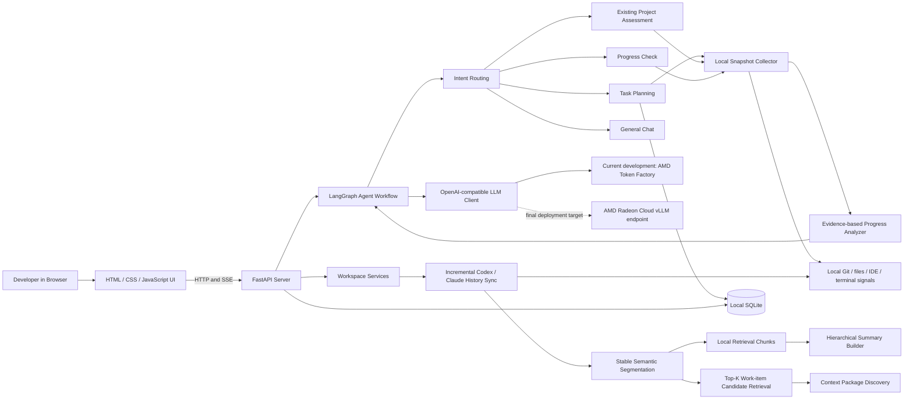

# Work Assistant — Project Specification

**Track:** Track 2 — Development & Local Deployment of Private AI Agents
**Project:** Work Assistant
**Status:** Source code, English documentation, a dedicated Radeon Cloud vLLM deployment, and a reproducible endpoint measurement are complete. Demo video, supplementary material, and the official pull request remain pending.

## 1. Executive Summary

Work Assistant is a local-first web application that helps individual developers recover development context after interruptions. It unifies local project evidence, task plans, and local AI coding conversation history into a single workspace, then uses a language model to turn bounded, relevant evidence into actionable plans, progress reports, risks, and next steps.

The project addresses a recurring problem in AI-assisted development: work context is fragmented across Git history, modified files, terminal sessions, IDE state, and long Codex or Claude conversations. Reconstructing that context manually is slow and error-prone. Work Assistant keeps the data collection and persistence layer on the developer's own machine, while using an OpenAI-compatible model endpoint only for reasoning and summarization.

## 2. Application Scenario and Target Users

### 2.1 Problem

Developers who work across several repositories or resume work after an interruption need answers to the following questions:

1. What was I trying to accomplish?
2. What changed in the local project since I last worked on it?
3. Which plan steps are supported by evidence, and what should I do next?
4. Which earlier AI coding conversations are relevant to the current project?

Existing tools often expose only one source of truth: Git shows code history, an IDE shows the open project, and an AI coding tool shows its own conversation. None of them creates a reusable, evidence-based recovery view across all of those sources.

### 2.2 Target Users

- Individual software developers using Git and local IDEs.
- Developers who use Codex or Claude for multi-session coding work.
- Developers managing several projects and needing a quick, private work-context recovery workflow.

### 2.3 Typical Workflow

1. The developer opens Work Assistant locally in a browser.
2. They ask the agent to create a task, assess an existing project, or check task progress.
3. The application collects allowed local evidence such as Git state, project structure, and work-session signals.
4. The agent creates or updates a structured task plan and reports the likely current state, risks, and next action.
5. The developer can synchronize local Codex and Claude histories into the workspace, associate them with projects, and create reusable context packages for continuation.

## 3. System and Agent Architecture



### 3.1 Main Components

| Component | Implementation | Responsibility |
|---|---|---|
| Web service | FastAPI + Uvicorn | HTTP APIs, web pages, server-sent events, setup and health checks |
| Agent workflow | LangGraph | Intent routing, multi-turn state, task creation, project assessment, and progress flow |
| LLM integration | LangChain OpenAI client | Calls an OpenAI-compatible model endpoint for reasoning tasks |
| Local evidence collector | Python, Git, filesystem, process inspection | Builds a project snapshot from selected local development signals |
| Task service | Python + SQLite | Persists tasks, steps, sub-tasks, and progress state |
| Workspace service | Python + SQLite | Stores projects, imported conversations, stable semantic segments, retrieval chunks, work items, and context packages |
| Incremental analysis and retrieval | Local lexical retrieval + bounded prompts | Preserves stable evidence, processes only changed conversation tails, retrieves relevant history, and bounds model context |
| Browser UI | Jinja2 templates, HTML, CSS, JavaScript | Provides setup, chat, conversations, and workspace interfaces |

### 3.2 Agent Decision Flow

The agent classifies an incoming request as one of four intents:

- **new_task** — collect project paths and a goal, then generate a task plan;
- **check** — collect project paths and background, inspect the existing project, then generate an initial plan and report;
- **progress** — load a previously saved task, collect a fresh snapshot, and compare evidence against the plan;
- **chat** — answer a general development-management question.

Each multi-turn agent session is checkpointed locally. The FastAPI service streams status and response events to the browser through SSE and supports explicit cancellation of a running request.

## 4. Core Capabilities

### 4.1 Task Planning and Recovery

The agent turns a natural-language goal and project paths into a structured task, plan steps, and sub-tasks. For an existing repository, it can inspect the current state first and create an initial plan from both the conversation and local evidence.

### 4.2 Evidence-Based Progress Analysis

The snapshot collector can inspect project type markers, Git branch and remote metadata, recent commits, changed files, diff summaries, modules, selected IDE/work-session signals, terminal history, and development processes. The progress analyzer compares this evidence with the stored plan and returns:

- completion estimate;
- step-level status and supporting evidence;
- current step;
- next action; and
- identified risks.

The output is intentionally presented as an AI-assisted assessment, not as an irreversible source of truth.

### 4.3 Local AI Conversation Workspace

The workspace incrementally imports local Codex and Claude conversation data without modifying raw source histories. A longest-common-prefix reconciliation keeps unchanged message prefixes and stable segment identities intact. When a conversation grows, only the final affected segment and newly appended segments are re-segmented and eligible for reclassification; previously classified, unchanged evidence and context-package sources remain reusable.

For long histories, the application creates bounded overlapping retrieval chunks and selects relevant local evidence before a focused summary request. If a complete summary is required but exceeds the prompt budget, a token-budgeted hierarchical map-reduce summary path is used. This prevents an entire historical transcript from being sent in every model request.

For work-item discovery, a local retriever selects a Top-K, character-budgeted candidate set from project work items. The model can match only against these relevant candidates or propose a new item; local similarity checks reduce duplicate work-item creation.

### 4.4 Privacy-Aware Data Handling

Application state is stored in local SQLite databases. API keys are excluded from the repository and can be stored in Windows Credential Manager through `keyring`. The user can configure whether commit information and diff summaries are included in model-analysis requests.

## 5. Model and Local Deployment Plan

### 5.1 Current Development Baseline

The current working baseline uses the official AMD Radeon Token Factory OpenAI-compatible API:

| Setting | Current value |
|---|---|
| Model | Qwen3.6-35B-A3B |
| API base URL | `https://developer.amd.com.cn/radeon/api/v1` |
| Client integration | `ChatOpenAI` / OpenAI-compatible API |
| Runtime location | Work Assistant web application runs locally on Windows |

This baseline is used for functional development and regression testing. It preserves the agent workflow, local persistence, and local project-inspection capabilities.

### 5.2 Radeon Cloud/vLLM Deployment

The LLM integration is centralized through configuration values (`AMD_BASE_URL`, `AMD_MODEL`, and `AMD_API_KEY`). Therefore, an AMD Radeon Cloud instance exposing an OpenAI-compatible vLLM endpoint can replace the development endpoint without rewriting the task, snapshot, workspace, or UI layers.

The dedicated deployment used for this submission is configured as follows. The endpoint API key is stored locally and intentionally omitted from this document and the repository.

| Setting | Measured deployment value |
|---|---|
| Cloud GPU | AMD Radeon Pro W7900 in Radeon Cloud |
| Container image | ROCm vLLM-dev (Navi): ROCm 7.2.1, Ubuntu 22.04, Python 3.10, PyTorch 2.9, vLLM 0.16.0 |
| Model source | HuggingFace mirror |
| Served model | `Qwen/Qwen3-14B` |
| Serve command | `vllm serve Qwen/Qwen3-14B --host 0.0.0.0 --port 8000` |
| Service interface | Dedicated OpenAI-compatible Radeon Cloud Model API on port 8000, exposed with a `/v1` base URL |
| Application integration | Work Assistant setup page supplies `AMD_BASE_URL`, `AMD_MODEL`, and a locally stored `AMD_API_KEY` |
| Persistence choice | Local SSD plus persistent PVC |

The local Work Assistant successfully completed a basic chat request after switching its setup configuration to this dedicated endpoint. The remaining demonstration validates a task-planning or progress-analysis workflow through the same endpoint.

## 6. AMD Radeon GPU Inference Configuration and Measurements

### 6.1 Deployment and Inference Choices

- Use vLLM as the dedicated model-serving layer on an AMD Radeon Cloud GPU instance.
- Keep the application on the OpenAI-compatible API contract so model serving can be changed without business-workflow rewrites.
- Use server-sent events to stream generated output to the browser instead of waiting for an entire response.
- Configure request timeouts and cancellation so a user can stop an unnecessary long-running generation.
- Select a 14B Qwen model that fits within the W7900's 48 GB class of memory while retaining stronger agent reasoning than a smaller smoke-test model.

This submission reports one deployed configuration and does not claim a before/after optimization gain that was not measured.

### 6.2 Measured Endpoint Result

The committed result file `bench-results/vllm-benchmark-20260805-121316.json` was generated on 2026-08-05 with one warm-up request followed by three measured, non-streaming requests. Each request used a fixed English prompt, temperature `0`, a 128-token completion cap, and the deployed `Qwen/Qwen3-14B` endpoint.

| Metric | Result |
|---|---:|
| Measured requests | 3, after 1 warm-up request |
| Prompt tokens per request | 27 |
| Completion tokens per request | 128 |
| Average end-to-end latency | 8,884.20 ms |
| Effective completion rate | 14.41 tokens/s |
| Per-run latency range | 8,878.24–8,892.05 ms |
| Per-run effective completion rate | 14.39–14.42 tokens/s |

The reported completion rate is completion tokens divided by the full non-streaming HTTP request duration, so it includes connection and request overhead. It is not a separate server-side streaming-token benchmark. Each measured request stopped at the configured 128-token cap (`finish_reason: length`).

### 6.3 Additional Metrics for the Demo

The demo will additionally show the following real evidence:

| Metric | Measurement method |
|---|---|
| GPU and ROCm environment | Radeon Cloud deployment status and redacted configuration screenshot |
| Model and serving configuration | Model name, vLLM image, serve command, and API path |
| Functional stability | Browser chat plus task-planning or progress-analysis workflows through the same endpoint |

### 6.4 Reproducible Measurement Procedure

The repository includes `scripts/benchmark_vllm.ps1`. It prompts locally for an API key without writing it to disk, performs one warm-up request and three fixed-prompt non-streaming requests, and writes a non-secret JSON result under `bench-results/`. The result records endpoint host, model, request parameters, per-run latency, token counts, and completion tokens per second.

```powershell
.\scripts\benchmark_vllm.ps1 `
  -BaseUrl "https://your-radeon-cloud-endpoint/v1" `
  -Model "Qwen/Qwen3-14B"
```

The generated JSON values above are committed without credentials. The final video will add redacted deployment evidence and an end-to-end application workflow.

## 7. Reproducibility and Validation

### 7.1 Local Setup

```powershell
python -m venv .venv
.\.venv\Scripts\Activate.ps1
python -m pip install -r requirements.txt
.\start.ps1
```

Open `http://127.0.0.1:8000`, complete the setup wizard, and provide either the Token Factory development configuration or the final Radeon Cloud/vLLM endpoint configuration.

### 7.2 Automated Validation

The current source baseline passes 146 automated tests:

```powershell
.\.venv\Scripts\python.exe -m unittest discover -s tests -v
```

The test suite covers agent flows, task persistence, settings and secret handling, streaming cancellation, external conversation synchronization, project matching, stable semantic segmentation, incremental analysis, bounded retrieval, hierarchical summaries, workspace operations, and UI/API behavior.

## 8. Demonstration Plan

The final 3–5 minute demonstration will show:

1. Local application startup and setup status.
2. A developer creating or assessing a project through the browser UI.
3. Local evidence collection and the resulting plan/progress report.
4. Workspace synchronization, incremental analysis, and context recovery from a local AI conversation.
5. The same application workflow calling the Radeon Cloud/vLLM endpoint.
6. Radeon GPU runtime evidence and the measured responsiveness of the workflow.

## 9. Delivery Status

| Deliverable | Current status |
|---|---|
| Complete source code | Complete |
| English README | Complete |
| English Project Specification | Complete; measured deployment data included |
| Radeon Cloud/vLLM deployment | Complete; local application basic chat verified |
| AMD GPU optimization measurements | One reproducible endpoint configuration measured; no unmeasured before/after claim |
| 3–5 minute demo video | Pending |
| Poster or presentation | Pending |
| Official Pull Request | Pending |

## 10. Limitations and Responsible Use

Work Assistant can inspect selected local development signals. Users should not point it at repositories containing information they are not authorized to analyze with the configured model endpoint. The progress percentage is an LLM-assisted estimate and requires developer review. Raw Codex and Claude histories remain read-only; Work Assistant stores separate derived analysis and context data locally.
